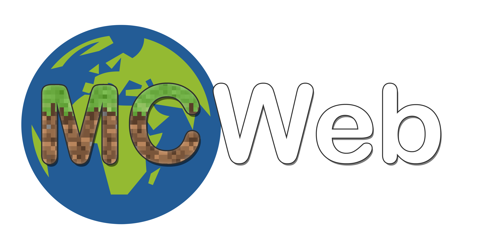

## **Canceled here, continued as [Semoxy](https://github.com/SemoxyMC)**



---
# MCWeb - a Minecraft Server Web Interface

MCWeb is a web-remote Minecraft Server Wrapper for controlling your Minecraft Server with ease.

## Disclaimer

This is meant for private use, don't use in production. Be careful with port forwarding. Use this preferably in your local network.

**Currently in development!**, not safe to use

## Requirements

* docker ([Linux](https://docs.docker.com/engine/install/ubuntu/), [Windows](https://docs.docker.com/docker-for-windows/install/))
* Python 3 ([Download](https://www.python.org/downloads/))
* docker-compose ([Installation](https://docs.docker.com/compose/install/))
* git ([Installation](https://git-scm.com/book/en/v2/Getting-Started-Installing-Git))

## Installation

### Linux

Clone this repository using `git clone "https://github.com/xImAnton/mcweb.git"`.

`cd` into the downloaded repository and run `sudo bash install.sh`.

Once the installation script is done, just use `docker-compose` to start the application.

When you're getting errors, because your python executable couldn't be found, run `PYTHON_CMD=<your_python_command> ` before executing the installation script.

If you want to change the HTTP port of the application, change the first `80` in the ports section of the `client-server` service to whatever port you want. The API is proxied by the frontend server, so you don't have to change anything else.

```yaml
  - BACKEND_ADDRESS=mcweb-backend:5001
    ports:
      - "80:80"
    depends_on:
```

```yaml
  - BACKEND_ADDRESS=mcweb-backend:5001
    ports:
      - "5000:80"
    depends_on:
```

### Windows

I'll write a installation script for Windows soon. If you have a server machine, I recommend getting Linux.

## App Overview

### Server Creation

You can create Minecraft Server with one click using MCWeb. Just enter a name, change the Port if needed, enter the RAM your server should have and select the Version. You can create simple Vanilla Servers (by Mojang), Snapshot Servers (development versions), Paper Servers (faster than vanilla, default) and of course Forge Servers for running various Mods.


### Console

You can control your Minecraft Server from everywhere. Just enter a [Minecraft Command](https://minecraft.fandom.com/wiki/Commands) or press a single button to give yourself OP (Operator Rights. [WIP]


### Mod Selection

When you chose a Forge Server, you can install and remove every Minecraft Mod with one click.


## Repository Structure
Directory/ File  | Description
---|---
.idea | PyCharm Config Files
docs | Documentation Markdown and Images
mcweb | Backend Python Module, used by run.py
mcweb-client | Frontend Code, Node Package
mcweb-mongo | MongoDB Dockerfile and initial Values
Dockerfile | Dockerfile for building the backend container
defaultConfig.json | the default config values, needs to be renamed to config.json
docker-compose.yml | docker-compose used to run the application
install.sh | installation shell script
run.py | Python file that starts the backend
